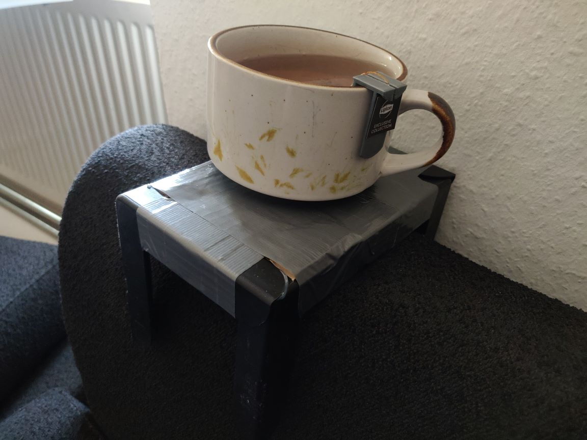
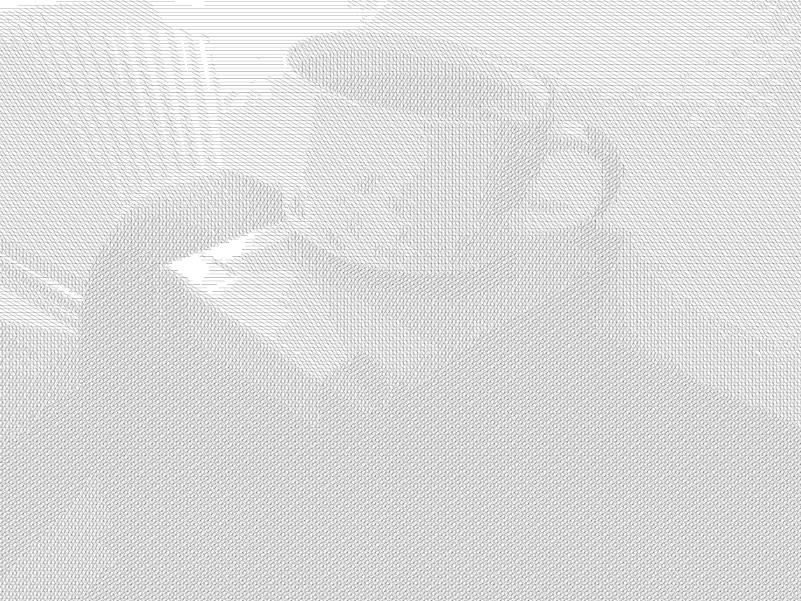

This project contains a processing sketch for creating a crosshatched version of an input image.

 

# Usage
1. Choose an image to crosshatch and save it into the same folder as hatcher.pde.
2. Consider the image dimensions. As the crosshatched version usually won't require a high fidelity image, a high resolution will just increase runtime. Consider changing the dimensions to fit within 1000x1000px.
3. Open sketch.pde
4. Change the variable 'input_name' (line 4) to match your input file's name.
5. Change the variables 'input_width' (line 11) and 'input_height' (line 12) to the dimensions of your file.
6. Change 'size(W,H)' (line 18) such that W and H are the width resp. height of your file. 
8. Run the program.
9. The output will be shown, and the seperate svg layers will, by default, be saved to a folder 'output_layers'.

# Parameters
Several parameters may be altered to achieve different results. In particular:
* int nr_layers (line 6): the number of crosshatch-layers to be used.
* int v_line_offset (line 8): the space between two lines within one crosshatch-layer
* float blur-radius (line 9): because, often, we don't want the smallest details to appear in our crosshatch, we apply a Gaussian blur. This radius determines it's size. A size of 0 can be used to not use a blur.
* boolean save (line 14): the program will save the layers if and only if 'save' is set to true. Not saving would still display the image, and is useful e.g. in tweaking the parameters.

# Notes
Though the layers are saved as svg, in actuality these svgs contain images... At the moment, it is advised to use other programs to convert this to actual vector layers.